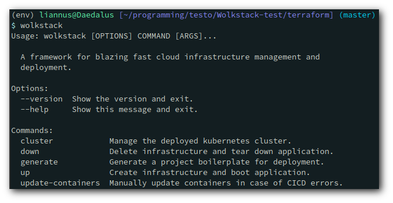

# Wolkstack


## Table of Contents
- [About the Repo](#about-the-repo)
- [Getting Started](#getting-started)
- [Code Structure](#code-structure)
- [Tech](#tech)
- [Contributors](#contributors)
- [License](#license)


## About the Repo
This repo shows the development state of the Wolkstack project, a cloud development framework for 

Despite being available on github, this repository is intended as a read-only resource and has been licensed as such. Permissions are not given to use or modify this software.

## Getting Started
Wolkstack requires several steps and infrastructure pieces to be setup for optimal usage, the exact steps to install the below software will not be included in this documentation, although tutorials can be found on the provided pages.

Required programs:
- [KubeCTL](https://kubernetes.io/docs/tasks/tools/install-kubectl/)
- [AWS CLI](https://docs.aws.amazon.com/cli/latest/userguide/cli-chap-install.html)
- [Terraform](https://learn.hashicorp.com/tutorials/terraform/install-cli)
- [Helm](https://helm.sh/docs/intro/install/)
- [Python](https://www.python.org/downloads/)

With this complete some pre-steps are required to ensure that credentials are generated in your project.

### AWS CLI 
Ensure that you have run `aws configure` and set your authentication credentials locally in your computer

### Environment Credentials
Terraform requires some basic credentials to run CI/CD services on your AWS account, the exact commands to set these are shown below.

This code makes use of environment variables to ensure that the user does not expost information, additionally credentials are encrypted and made use of with AWS parameter store, a secure repository for this use case.

#### Docker-Hub
To deploy containers and install applications we need a docker-hub credential which can be set with:

export TF_VAR_docker_hub_password={password}

#### Github
To setup web-hooks and access code for CI/CD on your private repositories, how to get the [token](https://docs.github.com/en/free-pro-team@latest/github/authenticating-to-github/creating-a-personal-access-token):

export TF_VAR_github_token={token}
  
### Install
Wolkstack is available as a simple [PyPi package](https://pypi.org/project/Wolkstack/)
and can be installed with command `pip isntall Wolkstack`

Once installed steps and commands can be followed inside the Wolkstack CLI.
  
## Code Structure
Explained here are the most important points of the code structure, where to find configs, etc.
```
tbd
```

## Architecture
An full example wolkstack deployment is shown here.


## Tech
Wolkstack sets you up with a standard set of tools that can be switched and replaced as desired, a list of used technology can be seen here.

### Automated Deployments
- [Terraform](https://www.terraform.io/)
- [Helm](https://helm.sh/)
- [Docker](https://www.docker.com/)
- [KubeCTL](https://kubernetes.io/docs/tasks/tools/install-kubectl/)

#### Cluster Tools
- [External-DNS](https://github.com/kubernetes-sigs/external-dns)
- [Cert-Manager](https://cert-manager.io/)
- [Nginx-Ingress](https://kubernetes.github.io/ingress-nginx/)

### Continuous Deployment / Continous Integration
- [AWS Codebuild](https://aws.amazon.com/codebuild/)
- [AWS Codepipeline](https://aws.amazon.com/codepipeline/)
- [Docker Hub](https://hub.docker.com/)

### Service setup:
#### Frontend
- [Node](https://nodejs.org/en/)
- [React.js](https://reactjs.org/)

#### Backend:
- [Node](https://nodejs.org/en/)
- [Express](https://expressjs.com/)

#### Database:
- [PostgreSQL](https://www.postgresql.org/)

## Contributors
- Josh Gorman
  + [Github](https://github.com/Liannus)
  + [Website](https://joshgorman.ca/)
  
## License
Copyright 2020 Josh Gorman

Permission is hereby granted, free of charge, to any person obtaining a copy of this software and associated documentation files (the "Software"), to deal in the Software without restriction, including without limitation the rights to use, copy, modify, merge, publish, distribute, sublicense, and/or sell copies of the Software, and to permit persons to whom the Software is furnished to do so, subject to the following conditions:

The above copyright notice and this permission notice shall be included in all copies or substantial portions of the Software.

THE SOFTWARE IS PROVIDED "AS IS", WITHOUT WARRANTY OF ANY KIND, EXPRESS OR IMPLIED, INCLUDING BUT NOT LIMITED TO THE WARRANTIES OF MERCHANTABILITY, FITNESS FOR A PARTICULAR PURPOSE AND NONINFRINGEMENT. IN NO EVENT SHALL THE AUTHORS OR COPYRIGHT HOLDERS BE LIABLE FOR ANY CLAIM, DAMAGES OR OTHER LIABILITY, WHETHER IN AN ACTION OF CONTRACT, TORT OR OTHERWISE, ARISING FROM, OUT OF OR IN CONNECTION WITH THE SOFTWARE OR THE USE OR OTHER DEALINGS IN THE SOFTWARE.


